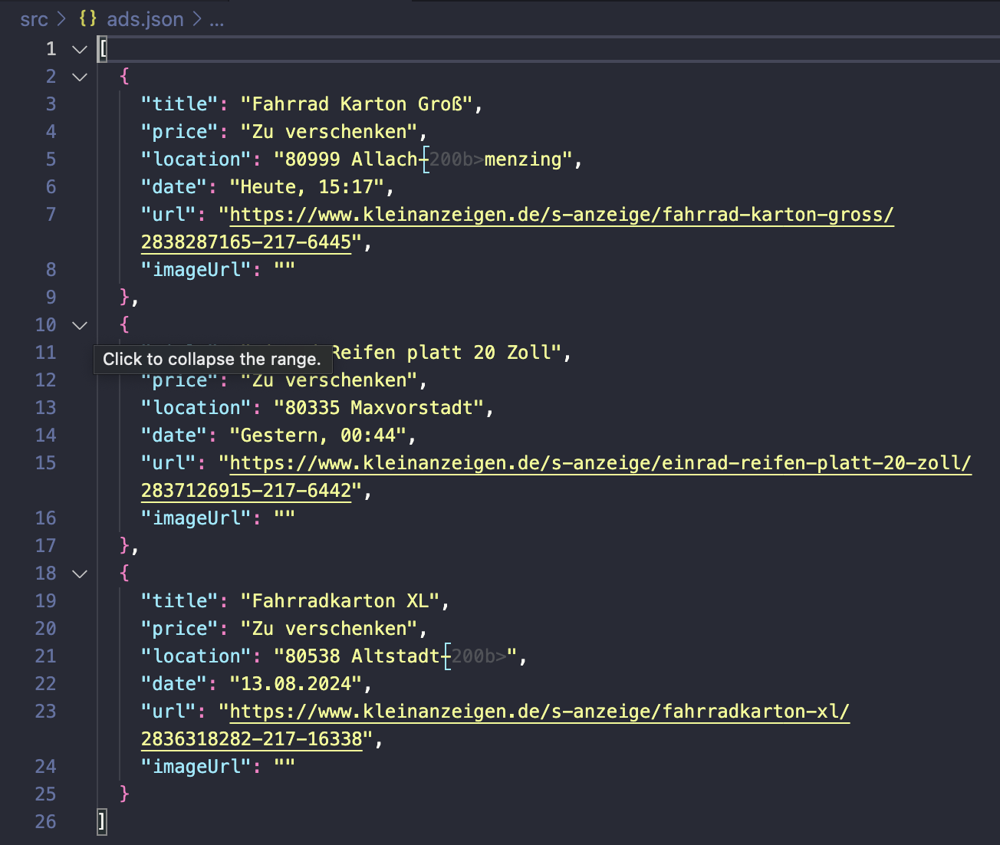
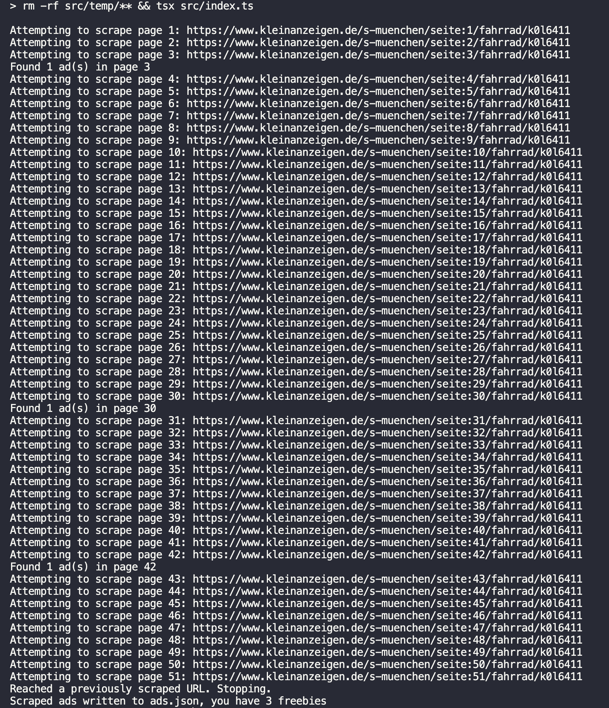

# Kleinanzeigen Scraper
Scrape free stuff from [Ebay Kleinanzeigen](https://www.kleinanzeigen.de/s-muenchen/fahrrad/k0l6411) into a json file

## Requirements
NodeJS, npm & pnpm

## Usage
1. Clone the repository
2. In the terminal, `cd` to project directory, then run `pnpm install`
3. Visit [ebay kleinanzeigen,](https://www.kleinanzeigen.de/) search for a product/service within a location
4. Copy the resulting url from the browser's address bar
5. Open `src/index.ts` file in the project and set the `url` variable to the copied url
6. run `pnpm scrape` from the project root directory in the terminal
7. Wait for scraping to finish, total scraped data is written to `ads.json` file in the root of the project, to see scraped data per page look in the temp folder

## Legal Information

1. **Disclaimer of Warranties**: The software is provided "as is," without warranty of any kind, express or implied, including but not limited to the warranties of merchantability, fitness for a particular purpose, and non-infringement.

2. **Limitation of Liability**: In no event shall the author be liable for any claim, damages, or other liability, whether in an action of contract, tort, or otherwise, arising from, out of, or in connection with the software or the use or other dealings in the software.

3. **Indemnification**: By using this software, you agree to indemnify, defend, and hold harmless the author from and against any and all claims, liabilities, damages, losses, or expenses, including reasonable attorneys' fees and costs, arising out of or in any way connected with your access to or use of the software.